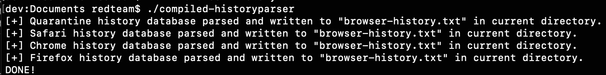

# macOS Browser History Parser

Sample Swift code to parse the following history databases on macOS:

- Quarantine events history database (/Users/[user]/Library/Preferences/com.apple.LaunchServices.QuarantineEventsV2)
- Safari history database (/Users/[user]/Library/Safari/History.db)
- Chrome history database (/Users/[user]/Library/Application Support/Google/Chrome/Default/History)
- Firefox history database (/Users/[user]/Library/Application Support/Firefox/Profiles/<random>.default-release/places.sqlite)

The results are written to the same directory in a file named "browser-history.txt".

Steps:
1. You can pull the project down, make whatever modifications you desire, and compile your own binary OR you can use the compiled binary included here in the repo named "compiled-historyparser".
2. Depending on your use of the binary, you may need to sign and notarize it first or remove the quarantine flag (xattr -d [binary name]) (if you plan to download it via a browser and run it). Otherwise you should be fine

